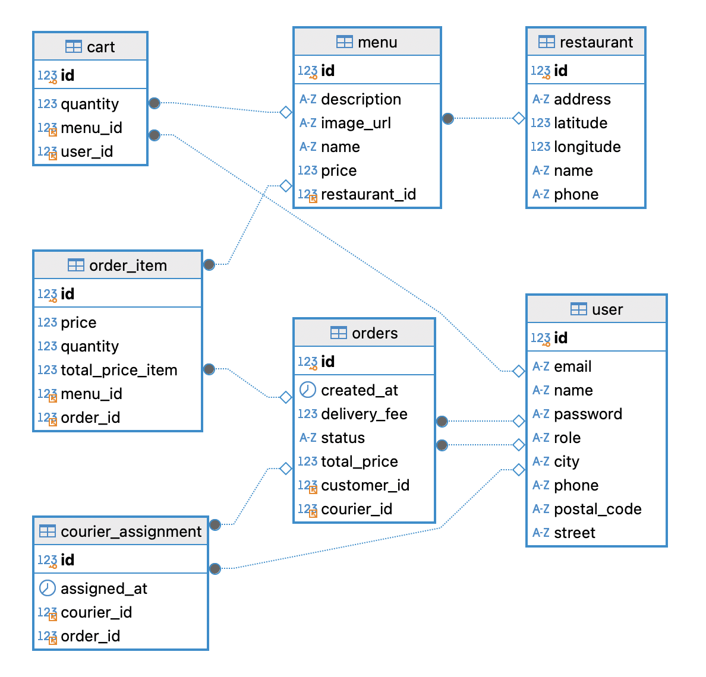

# ZamoraGG Food Delivery

## Deskripsi
ZamoraGG Food Delivery adalah platform layanan pesan-antar makanan daerah Jatibarang, Indramayu, Jawa Barat yang memudahkan pengguna untuk memesan berbagai menu dari restoran terdekat. Sistem ini memiliki dashboard khusus untuk pelanggan, kurir, dan admin agar proses pemesanan dan pengantaran lebih efisien.

## Fitur-fitur
- **Customer**
  - Registrasi dan login
  - Melihat daftar restoran dan menu
  - Membuat pesanan makanan
  - Melacak status pesanan secara real-time
  - Melihat history pesanan

- **Courier**
  - Login sebagai kurir
  - Melihat daftar pesanan yang harus diantar
  - Update status pesanan (ASSIGNED → PICKED_UP → ON_DELIVERY → DELIVERED)
  - Melihat riwayat pesanan yang sudah selesai

- **Admin**
  - Login sebagai admin
  - Mengelola data restoran, menu, dan kurir
  - Melihat semua pesanan dan statusnya
  - Mengelola laporan transaksi

## ERD

## Tech Stack
- **Frontend:** React, Tailwind CSS, Framer Motion, React Router, Axios
- **Backend:** Java Spring Boot
- **Database:** MySQL
- **Charting / Visualisasi:** Recharts
- **Icons:** Lucide-react
- **Environment Variables:** Vite (VITE_API_BASE_URL)
